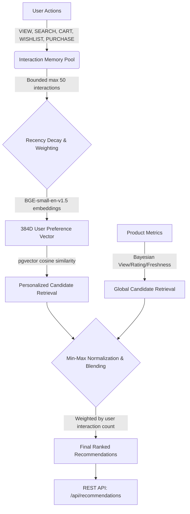

# Sellora AI Recommendation System Architecture

This document serves as the technical documentation for the Sellora Recommendation Engine, built on Spring Boot, PostgreSQL, and pgvector. It outlines the interaction strategy, vector mathematics, cold-start handling, and blending pipeline.

## 1. Architecture Overview
The recommendation system uses a strictly bounded memory pool of interactions to compute a real-time semantic preference vector, which is mathematically blended with global statistical signals to serve highly relevant product recommendations.

## 2. Step 13: Bounded Interaction Memory
We capture specific high-value user behaviors and map them to `UserInteraction` entities.

- **Supported Types & Configurable Weights:**
  - `VIEW` (Weight: 1)
  - `SEARCH` (Weight: 2)
  - `WISHLIST` (Weight: 3)
  - `CART` (Weight: 4)
  - `PURCHASE` (Weight: 5)
- **Search Handling:** If the user performs a search, the `Product` reference is left null, and the explicit `searchQuery` string is saved instead.
- **Intelligent Pruning (Max 50):** To prevent infinite database growth and keep preferences relevant to current tastes, memory is strictly bounded to 50 interactions. If the threshold is breached, older and lower-weight interactions are deterministically deleted (`ORDER BY weight ASC, createdAt ASC, id ASC`).

## 3. Step 14: Preference Vector Construction
Interactions are transformed into a semantic fingerprint of the user.
- **Product & Search Embeddings:** For product interactions, we reuse the existing 384-dimensional `BGE-small-en-v1.5` product embeddings. For search queries, we dynamically generate a vector on the fly using our `ProductEmbeddingService`.
- **Exponential Recency Decay:** Interactions decay over time using the formula `weight * e^(-lambda * days_passed)`. A recent `VIEW` may outrank a week-old `CART` addition.
- **On-Demand Generation:** The 384-dimensional preference vector is calculated entirely on the fly. We do not persist it to the database because user preferences constantly drift, and writing dense vectors on every click would quickly bottleneck the database write throughput.

## 4. Step 15: Personalized Candidate Retrieval
Using the generated user preference vector, we query the `Product` table.
- **pgvector Cosine Similarity:** We execute `<=>` exact search natively inside PostgreSQL.
- **Filtering:** Only products with `is_active = true` and `embedding IS NOT NULL` are queried.
- **Exclusions:** We exclude products the user has already purchased (if configured) so we don't blindly recommend items they already own.
- **Output:** Returns a pool of `CandidateDTO` objects containing the raw cosine similarity score.

## 5. Step 16: Global Candidate Retrieval (Cold Start)
For new users with no semantic history, we fall back to a global popularity model.
- **Signals:** We analyze `viewCount`, `rating`, `reviewCount`, and boolean freshness (`isNewArrival`, `isFeatured`).
- **Score Normalization:** Adding raw view counts to a 1-5 rating is mathematically invalid. We utilize logarithmic scaling for view counts and Bayesian averages for ratings.
- **ViewCountInitializer:** During local development, global data is often missing. The `ViewCountInitializer` artificially injects organic-looking view metrics to allow realistic cold-start benchmarking.

## 6. Step 17: Score Normalization and Blending
Because semantic cosine similarity (0.0 - 1.0) and global statistical scores (unbounded) are on completely different scales, we mathematically align them using **Min-Max Normalization** bounded precisely to `[0.0, 1.0]`. 

### The Personalization Progression
A hard switch from global to personalized recommendations causes jarring user experiences. We slowly transition the blended ratio depending on the user's interaction count:
- **0–4 interactions:** 100% Global
- **5–19 interactions:** 70% Global / 30% Personalized
- **20–49 interactions:** 40% Global / 60% Personalized
- **50+ interactions:** 20% Global / 80% Personalized

*Note: If a candidate exists in both the global and personalized pool, their normalized scores are aggregated together, pushing universally popular semantic matches to the absolute top of the list.*

## 7. The Cold-Start Strategy Flow
1. **User with 0 interactions** requests `/api/recommendations`.
2. The orchestrator (`RecommendationService`) immediately detects `< 5` interactions.
3. **Short-Circuit:** It entirely skips hitting the ML embedding generator or running complex `pgvector` math.
4. It executes the lightweight global algorithm and returns universally popular active products.
5. As the user clicks products, the threshold climbs until it breaches 5 interactions, at which point semantic vectors begin seamlessly bleeding into their results.

## 8. Interaction-to-Preference Example
1. **Views "Black oversized T-shirt"** -> The system pulls the product's vector and applies a 1.0 base weight.
2. **Searches "oversized cotton black tee"** -> The system generates a vector for the query and applies a 2.0 base weight.
3. **Adds "Cotton hoodie" to cart** -> The system pulls the hoodie's vector and applies a 4.0 base weight.
4. **Result:** The system mathematically aggregates these 3 vectors based on their weights and recency. The final 384-dimensional vector semantically represents "loose-fitting, black, cotton upper-wear". When run through pgvector, similar aesthetic items will surface.

## 9. Technology Stack
- **Core Backend:** Java 17, Spring Boot 3
- **Database:** PostgreSQL 16
- **Vector Engine:** pgvector extension
- **ML Model:** BGE-small-en-v1.5 (384 dimensions) via ONNX Runtime Java
- **ORM:** Spring Data JPA / Hibernate

## 10. Why We Don't Need Redis, Kafka, HNSW, or Python
At the current catalog size (~1,900 products):
1. **PostgreSQL handles exact vector math instantly:** At < 10,000 items, `pgvector` full-table scans easily execute in under `50ms`. An HNSW or IVFFlat index would only consume unnecessary RAM without tangible speed benefits.
2. **Synchronous writes are cheap:** Bounded insertions of a single Interaction row per request add negligible overhead, eliminating the need for Kafka event buses.
3. **JVM ML inference is native:** ONNX Runtime runs the BGE embedding model directly inside the JVM, completely sidestepping network hops to Python microservices.

## 11. Performance Characteristics
A benchmark run executed on the existing hardware/catalog size yielded the following latencies:
- **0 Interactions (100% Global):** `~22 ms`
- **50 Interactions (80% Personalized):** `~150 ms`
  *(Breakdown: 136ms for vector-build/pgvector search, 5ms for global fallback, 0ms for memory blending)*

## 12. Known Limitations
- **Fixed Memory Window:** Max 50 interactions may clip long-term multi-year preference shifts.
- **Manual Heuristics:** Weights, decay lambdas, and progression thresholds are manually tuned via `application.properties` rather than dynamically learned by an ML reranker.
- **Mock Data Dependency:** The `ViewCountInitializer` injects artificial metrics during development. Real production environments will require organic interaction volume before global recommendations become highly effective.

## 13. Configuration Reference
These configurations are actively used in the codebase:
- `recommendation.decay-lambda: 0.1`
- `recommendation.final-result-limit: 20`
- `recommendation.pool-multiplier: 2.0`

## 14. Key Classes
- `RecommendationController`: The REST layer mapping DTOs.
- `RecommendationService`: The orchestrator handling Min-Max blending and progression logic.
- `UserPreferenceService`: Handles recency decay and 384D vector construction.
- `UserInteractionService`: Handles interaction tracking, limiting, and tied-pruning.
- `PersonalizedRecommendationService`: Interfaces with `ProductRepo` for pgvector queries.
- `GlobalRecommendationService`: Handles Bayesian and logarithmic scoring.
